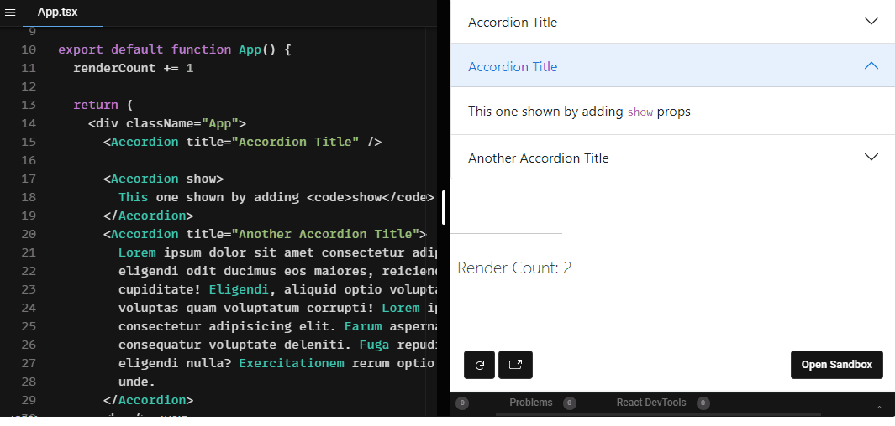

# React Bootstrap Accordion

> A simple react component for adding a nice vertically collapsing accordions based on bootstrap 5 [Accordion](https://getbootstrap.com/docs/5.0/components/accordion/).

[](https://www.npmjs.com/package/react-bootstrap-accordion) [](https://standardjs.com)

<p align="center">
  
</p>

## Install

#### npm

```sh
npm i react-bootstrap-accordion
```

#### Yarn

```sh
yarn add react-bootstrap-accordion
```

## Usage

```jsx
import React from 'react'
import { Accordion } from 'react-bootstrap-accordion'

const MyComponent = () => {
  return (
    <div className='App'>
      <Accordion /* Props */ />
    </div>
  )
}
```

## Props

| Prop       |   Type    | Options  | Description                     |      Default      |
| ---------- | :-------: | -------- | ------------------------------- | :---------------: |
| `title`    |  String   | Optional | Accordion Title                 | `Accordion Title` |
| `show`     |  Boolean  | Optional | Make accordion shown by default |      `false`      |
| `children` | ReactNode | Optional | Accordion body                  |   `Lorem text`    |

---

## Style

The Component is based on Bootstrap 5 `HTML` structure and `CSS` classes so it will work out of the box if Bootstrap 5 css stylesheet is already included in you project. If you don't have/want to include Bootstrap, you still can use a `standalone` css stylesheet which was extracted form bootstrap 5 stylesheet. Just add it:

```jsx
import 'react-bootstrap-accordion/dist/index.css'
```

### [Demo](https://react-bootstrap-accordion.vercel.app)

<br />

[](https://codesandbox.io/s/react-bootstrap-collapse-accordion-example-3k5du?fontsize=14&hidenavigation=1&theme=dark)

### License

MIT © [awran5](https://github.com/awran5/)
